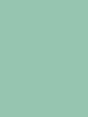

= Memoria del proyecto

== Introducción
Los miembros del proyecto somos Carmona Hernandez Ferran, Galindo Palacio Joan y Camilo Jumelle. Este proyecto tratará de realizar una aplicación que permitirá a los 
usuarios crear presentaciones. Las presentaciones que se podrán crear contaran con diversos tipos de diapositivas, y el usuario al final podrá ver su presentación. 
El target de esta aplicación serán personas que deseen trasmitir sus conocimientos a otro grupo de personas, y evaluar sus conocimientos. 

== Requisitos del proyecto

=== Sprint 1

==== R01: Definir guía de estilos de la aplicación 
  - Indicar paleta de colores
  - Tipografía 
  - Medidas de la fuente
  - Iconografía 
  - Botones
  - Enlaces
  - Elementos del formulario
  - Visualización de componentes 

==== R02: Determinar la base de datos 
  - Mínimo tablas Presentacions y Diapositives
  - Realizar un diagrama relacional
  - Preparar el Vagrant con la BD

==== R03: Pantalla Home 
  - De momento solo aparecerá un botón para crear una presentación 
  - Interactuando con él nos llevara a la pantalla CrearPresentación

==== R04: Pantalla crear presentación

  - Poner nombre a la nueva presentación 
  
  - Poner descripción a la presentación 
  
  - Añadir diapositiva tipo titol y titol+contenido 

==== R05: Guardar la presentación 
  - Poder guardar la presentación desde la pantalla crear presentación guardandose en la BD 

==== R06: Pantala Home: 

  - Aparecerán todas las presentaciones creadas hasta el momento
  
  - Ver opciones de ir a pantalla edición, eliminar presentación, clonarla y previsualizarla 

=== Sprint 2

==== R07: Editar presentación 
    
    - Modificar el nombre de la presentación
    
    - Modificar la descripción de la presentación
    
    - Añadir nuevas diapositivas al final de la presentación
    
    - Eliminar diapositivas existentes 
    
    - Reordenar las diapositivas (añadir tambien en crear)

==== R08: Eliminar presentación 

  - Eliminar la presentación con confirmación y feedback si se borra o no 

==== R09: Vista previa/estilos 

  - Al crear una presentación se le asigna un estilo, y se puede cambiar en editar. (Crear min 2 estilos)

==== R10: Vista previa Presentación 

  - Acceder desde crear, editar o Home. Se verá con el estilo elegido. Se puede interrumpir la visualización en cualquier momento. 

==== R11: Vista previa diapositiva 

  - Acceder desde crear o editar. Solo se ve la diapositiva elegida. Sin diferencia entre visualizar presentación. 

==== R12: Desplegamnet de l'aplicació en un servidor 

=== Sprint 3 

==== R13: Publicación de las presentaciones 

  - Atributo si estan publciadas o no

  - Inicialmente no están publicadas

  - Se puede publicar desde home y editar 

  - Al publicarse se genera un url unico

  - Las presentaciones tendran vista propietario y cliente (desde la url)

  - La vista cliente permite ver las miniaturas de todas las diapositivas

==== R14: Pantalla editar presentación 

  - Tipo diapositiva nueva (titol + contenido + imagen)

  - La diapositiva con imagen solo permite una por diapositiva

  - Realizar el diseño de previsualizar

==== R15: Atributo PIN en presentaciones 

  - Todas las presentaciones tienen un atributo pin opcional

  - Si se indica un PIN cuando se conecta a vista cliente se muetsra introducir un pin en vez de la primera diapositiva

  - No aplica en vista propietario

=== Sprint 4

==== R16: Diapositivas preguntes de seleccion simple

  - Tipo nuevo con una pregunta y varias respuestas

  - Debe de haber una respuesta correcta

  - OPCIONAL Es posible agregar una imagen en este tipo de diapositiva

  - Modificar la previsualizacion de este tipo

  - Vista cliente puede responder la pregunta

  - Una vez ya respondida no se puede volver a responder hasta que no se cierre el navegador

  - Responder una pregunra habilita la visualización de la respuesta

  - En las diapositiva tipo respuesta se vera la pregunta, las respuestas y la respuesta correcta amrcada

  - En miniaturas solo se verán las diapositivas respuesta si se respondio a la pregunta 

== Seguimiento semanal
// Actualizar cada viernes con descripción y valoración

=== Semana 1 (9, 10, 11 y del 16 al 21): 
Primeramente hemos definido la guía de estilos de la aplicación, decidimos los colores de la página, la tipografía, y hemos elegido varios iconos para la aplicación.
Seguido de ello decidimos como será la base de datos, haciendo el diagrama y preparamos el vagrant para la bd, luego de poder conectar la bd con éxito, nos pusimos a hacer
los sketch y Mockups de las pantallas a realizar. Al completar los Mockups empezamos a crear los html y css de la pantalla home y crear presentación, además del js 
de crear presentación. Luego de completar los códigos empezamos a ver como guardar la presentación al vagrant, mientras lo haciamos descubrimos fallas en el js el cual 
cambiamos según vimos conveniente, aparte de ver tambien fallas en el html y creamos otras pantallas para poder completar la funcionalidad de la aplicación. Luego de conseguir 
guardar las presentaciones correctamente y que el diseño nos parezca aceptable terminamos de realizar la pantalla home con visualización de las presentaciones ya creadas. +

Luego de completar el sprint 1 de manera que creimos conveniente se nos dijo de observar mejor el diseño ya que el figma era algo distinto a lo que realizamos en las pantallas 
y sobre mejorar los feedback al usuario de por ejemplo cuando se crea una presentación.

Al empezar el sprint 2 actualizamos el trello, hicimos los sketchs de la pagina editar para luego comenzar a hacer el html y crear la opcion de eliminar. Comenzamos con la pagina editar
y realizamos la opcion de poder cambiar el nombre y la descripción de la presentación, y realizar la función de cambiar la posición del orden(aunque aun esa función no se guarda en la bd). +

=== Semana 2 (23-27) 
Se completo la pantalla editar, cambiamos el diseño del reordenamiento, agregamos la funcion de eliminar y modificar las diapositivas. Empezamos a realizar los mockup de 
las previsualizaciones, y los archivos php y js para que estos realicen la funcion. Creamos también los estilos de la previsualización y añadimos la función para que está 
se guarde en la bd y se muestre cada vez que el usuario le da a previsualizar. +
Comenzamos ha configurar el desplegament de la aplicación en isard en la máquina de Camilo (aún falta para poder entrar correctamente). +

Esta semana ,a excepcón de la máquina isard, a nuestro parecer logramos llegar a los requisitos en cuanto a funcionalidad, pero en cuanto a diseño nos hicieron ver 
que los iconos que elegimos la semana anterior no eran intuitivos por lo que tendremos que cambiarlos, y al cambiar una diapositiva no se queda la 
diapositiva elegida por lo que tendremos que cambiar el diseño de la eleccion. Y los feedbacks indicados por hacer la semana anterior la realizamos con alerts los cuales tambien nos
dijieton de cambiarlo. 

=== Semana 3 (30-3) 
Arreglamos los errores del sprint anterior y comenzamos el tercero. Realizamos las pantallas para crear y editar diapositivas con imagenes, realizamos las pantalla
vsita cliente, y creamos la función de publicar en conjunto con la función para copiar las urls de las presentaciones que se publicaron. También junto a eso hicimos que al momento de crear
la Presentación puedas añadir un pin a está y se le pedirá a los clientes en vistacliente para poder acceder a la presentación. +
Aparte de eso terminamos de configurar la maquina isard y ya se puede entrar de manera eficiente. +

Al terminar el tercer sprint vimos algunos fallos en cuanto a la relación con la maquina isard, fallos que tambien se noto en la correccion, las imagenes no se guardaban en la maquina
y el botón de cerrar previsualización no funcionaba correctamente. Aparte de esos fallos se nos índico que hay que añadir el estado de publicación en pantalla editar y home, ya que 
solo decia publicar. También se nos hizo ver que hay varios fallos de Overflow al modificar la medida de la pantalla, y también que al quitar restrincciones del html la aplicación aun así 
deja guardar la presentación o diapositiva y colapsa el diseño del html.  

=== Semana 4 (6-10)
Empezamos corrigiendo todos los errores del sprint anterior que se nos menciono. Mientras se comenzaba también el sprint 4. 
Confirmamos que todas las pantallas cumplieran cada uno de los requisitos, que el figma este acorde a lo que tenemos, revisamos el codigo html y css validandolos, y por último revisamos
todas las partes del código para poder comentarlas y ayudar a su entendimiento. 
El sprint 4 se comenzo haciendo las pantallas editar y crear de tipo pregunta, para luego añadirlo a las pantallas vista previa y visualizar diapositiva. Y por último hacer que esta 
al entrar desde cliente se pueda responder la pregunta. 

=== Semana 5 (13-15)
Terminamos de hacer el sprint 4, toques finales de la memoria y realizamos el video de presentación. 

== Diseño

=== Diseño de BD
Link hacia el diagrama relacional de la base de dades:  https://drive.google.com/file/d/1HUVLYU9hPKxmyfT6V3yxM_MYT2UfzMvv/view?usp=sharing[Diagrama]

=== Sketching  
Acá se podrán observar los sketch's de todas las pantallas de nuestra aplicación. + 

==== Pantala Home
image::PantallaHome.jpg[Sketch de la pantalla principal home, width=40%]

==== Pantalla crear diapositivas

==== Pantalla previsualizar

==== Pantalla validacion pin

=== Mockup de interfaces

Link al figma de las diferentes pantallas: 

- https://www.figma.com/file/L0cwsLQkG8uzz2khb70gTF/Pagina-Home?type=design&node-id=0%3A1&mode=design&t=SLndVBhAVoyvUGdy-1[Mockup Slides]

=== Guía de estilos

La paleta de colores que utilizaremos es un fondo azul grisáceo apagado (#96C5B0), ya que el color azul representa Inteligencia, seriedad y confianza. Mostrando este 
azul apagado queremos puntuar esta seriedad y consideramos que estos sentimientos que representa se adecuan correctamente a la temática de la aplicación.

El color de texto será negro, puesto que contrasta muy bien con el color de fondo y además muestra elegancia y formalidad. +
El estilo de texto que utilizamos es el Liberation Sans ya que es un texto simple y cómodo de leer para los usuarios, no presenta ninguna dificultad a la hora de la visualización por usuario como pueden presentar otros tipos de texto más editados.

image::liberationSans.png[Imagen del tipo de fuente utilizado]

Los iconos utilizados son del sitio web Font Awesome: https://fontawesome.com/icons +
Iconos utilizados en la aplicación: +

- https://fontawesome.com/icons/circle-plus?f=classic&s=solid[Icono de añadir]

image::add.png[width=80]

- https://fontawesome.com/icons/trash?f=classic&s=solid[Icono de eliminar]

- https://fontawesome.com/icons/pen-to-square?f=classic&s=solid[Icono de editar]

image::edit.png[width=80]

- https://fontawesome.com/icons/eye?f=classic&s=solid[Icono de previsualizar]

image::preview.png[width=80]

- https://fontawesome.com/icons/clone?f=classic&s=solid[Icono de clonar]

image::clonar.png[width=80]

- https://fontawesome.com/icons/palette?f=classic&s=solid[Icono de estilo]

image::estilo.png[width=80]

- https://fontawesome.com/icons/sort-up?f=classic&s=solid[Icono de ordenar arriba]

image::up.png[width=80]

- https://fontawesome.com/icons/sort-down?f=classic&s=solid[Icono de ordenar abajo]

- https://fontawesome.com/icons/link?f=classic&s=solid[Icono de copiar URL]

- https://fontawesome.com/icons/share-from-square?f=classic&s=solid[Icono de publicar]

- https://fontawesome.com/icons/house?f=classic&s=solid[Icono Home]

image::home.png[width=80]

- https://fontawesome.com/icons/circle-xmark?f=classic&s=solid[Icono de cerrar]

image::close.png[width=80]

- https://fontawesome.com/icons/circle-arrow-right?f=classic&s=solid[Icono de siguiente]

image::next.png[width=80]

- https://fontawesome.com/icons/circle-arrow-left?f=classic&s=solid[Icono de anterior]

Link del resumen esquemático de la guía de estilos: https://www.figma.com/file/NLUpqEUNShhgeqQzZvntOe/Guia-d'estils?type=design&node-id=0%3A1&mode=design&t=Qni8KE80LLjWfZ9U-1[Guía de estilos (figma)]

== Confección del manual de instalación/distribución de la aplicación
Para la instalación de esta aplicación debera de tener: +

- php (con extension pdo_mysql)

- mysql 

- GIT

Luego de instalarlos correctamente y tenga el repositorio git de este proyecto, necesita configurar la ip, el nombre de la bd, el usuario y password en codigo/controllers/config.php. 
Si lo hace correctamente deberia de poder abrir la aplicación sin ningun tipo de problema. +
Para obtener la última versión disponible de Slides abra el CMD o terminal y ubiquese en la carpeta del repositorio GIT 
 slidescarmonagalindojumelle, desde ahí ingrese: + 
  +
$ git pull  +
  +
Al darle enter vera como se actualizan los archivos requeridos para la aplicación. O si tiene ya la última versión disponible 
le saldra un mensaje diciendo 'Already up to date'. +

== Confección del manual de usuario integrado en la aplicación
=== Crear Presentación
Al entrar a la aplicación de slides, si es la primera vez que entra tan solo verá un botón azul el cual dice 'Crear una nueva presentación'
entrando ahí podrá comenzar a crear presentaciones. +
Una vez en la página de crear presentación debemos de indicar el nombre y una breve descripción de la presentación, tenga en cuenta que el 
límite del titulo de la presentación es de 25 cáracteres. También tiene la opción de ponerle un pin a su presentación, este pin se verá solo
para las personas con las que comparta la presentación una vez publicada. Si no coloca un pin podrá publicarla sin restrincción de quien entre 
a su presentación. +

=== Creación de las Diapositivas
Al crearla por unos tres segundos se verá un mensaje verde donde nos indicará que la presentación se ha creado con éxito y ya podemos comenzarar
a crear las diapositivas de nuestra presentación. Podemos observar en la parte superior un botón para volver a la pantalla inicial, el título de 
nuestra presentación y un botón para previsualizar nuestra presentación a medida que la creemos. +
Para crear diapositivas veremos en la parte del centro de nuestra pantalla un cuadro donde podremos escribir el título y debajo el botón para 
añadir la diapositiva. Si usted desea crear una diapositiva con título y un contenido en la parte de la derecha veras 3 botones, clickando 
en el segundo cambiará el formato de la diapositiva, si querés solo con título presiona 'título', si deseas un título y un texto presiona 
'contenido' y si además del título y texto deseas colocar una imagen presiona 'imagen'. En la versión imagen solo podrás añadir una imagen con 
un limite de 2MB presionando en 'Seleccionar archivo'. Clickando en el cuarto que dice 'Pregunta' podremos crear una diapositiva la cual para 
las personas con las que compartás tu presentación podrán responder y luego de eso verán la respuesta. En este tipo de diapositiva tendrás solo 
un titulo de la diapositiva, un texto para la pregunta y 2 respuestas, que pueden añadirse hasta 6, y deberás de seleccionar la respuesta correcta. +

Si usted ya escribió algo en la diapositiva y quiere saber como se vería en la visualización de la presentación puede ver un botón de un ojo en 
la derecha donde esta escribiendo la diapositiva, presionelo y se verá con el estilo default (Podrá cambiar el estilo más adelante). +
Mientras está diseñando la presentación podrá notar que cada diapositiva añadida se ira viendo en la parte izquierda con unos botones a su lado 
con estos botones podrá ir reordenando la presentación a su gusto. También puede volver a observar (pero no editar) cada diapositiva haciendo 
click en el título de está. +

=== Más funciones 
Una vez que a terminado con esta presentación puede dirigirse a la página principal con el botón de la izquierda superior que dice 'Home'. +
Acá podrá ver las presentaciones creadas hasta el momento, se verá el título de dicha presentación más varios botones. +

==== Editar presentación
El primer botón (iniciando por la izquierda) es el botón para editar la presentación, al precionarlo podrá volver a ver la presentación como 
en el momento en el que estaba creandola más unas funciones extras. Arriba debajo del título se añadieron 4 botones extras para personalizar 
aún más su presentación, comenzando por la izquierda tenemos modificar estilos, en esta pantalla podemos elegir el tema que más nos guste 
para nuestra presentación, a su lado esta el botón para editar la presentación acá podremos editar el titulo y descripción de la presentación,
despues tenemos el botón de publicaar presentación para que otros vean su presentación (la persona con la que la comparta no podrá editar su 
presentación) y copiar url, el copiar url solo podrá usarse una vez que la presentación sea pública. +
Además de estas 4 funciones también se verán unos botones a la derecha de los botones para reordenar las diapositivas, el cual nos permitirá 
eliminar las diapositivas. +

==== Eliminar presentación
Devuelta a la página Home, tenemos después del  botón de editar esta el botón de eliminar por completo la presentación dando click veremos un 
mensaje para confirmar y aceptando ya no se verá la presentación. +

==== Clonar presentación (no funcional)
El siguiente botón es el de clonar y este por el momento no creará una presentación adicional ni nos llevara a otra página. +

==== Vizualizar presentación
Después veremos otra vez el botón del ojo, que al igual que en crear o editar las presentaciones este también nos permite previsualizar la 
presentación completa con el tema que hayamos elegido en editar presentación. +

==== Publicar presentación
Y por último tenemos los botones que tambien vemos en editar presentación, los cuales nos permitiran publicar o despublicar la presentación 
(veremos si la presentación ya esta publicada si su color es verde, si es gris aún no ha sido publicada), y a su lado tenemos el botón para poder 
copiar la url de la presentación compartida. +
 +
Ya con toda esta información usted ya será capaz de crear unas increibles presentaciones. 

== Linias futuras
Nos hubiese interesado implementar la función de clonar en la aplicación, creación de usuarios y sesiones cada uno con sus presentaciones, añadir 
más estilos para las presentaciones y una función para exportar tu presentación a un archivo powerpoint.

== Concluciones 

Si se realiza satisfactioriamente este proyecto el alumno contará con conocimientos sobre: 

- Aplicación del diseño a páginas en html y css

- Controlar la información dada por el usuario para pasarla satisfactoriamente a la base de datos

- Se ideará para poner eventos en java de manera sincrona

- Resolución de errores

- Podrá adaptar un código antiguo a nuevos requisitos

- Subida de proyecto a servidores.

== Glosario

- https://developer.mozilla.org/en-US/[MDN]

- https://stackoverflow.com[Stack Overflow]

- https://www.w3schools.com[W3Schools]

- https://fontawesome.com[Font Awesome (iconos)]

== Presentación del proyecto

Para ver el video del proyecto puedes verlo en la carpeta de docs bajo el nombre de "Video_Slides.mp4" o verlo en el siguiente link: 

- https://drive.google.com/file/d/1abNxpRdn7qZqEen5P3g8qNYnLT3J3nvf/view?usp=sharing[Link al video]